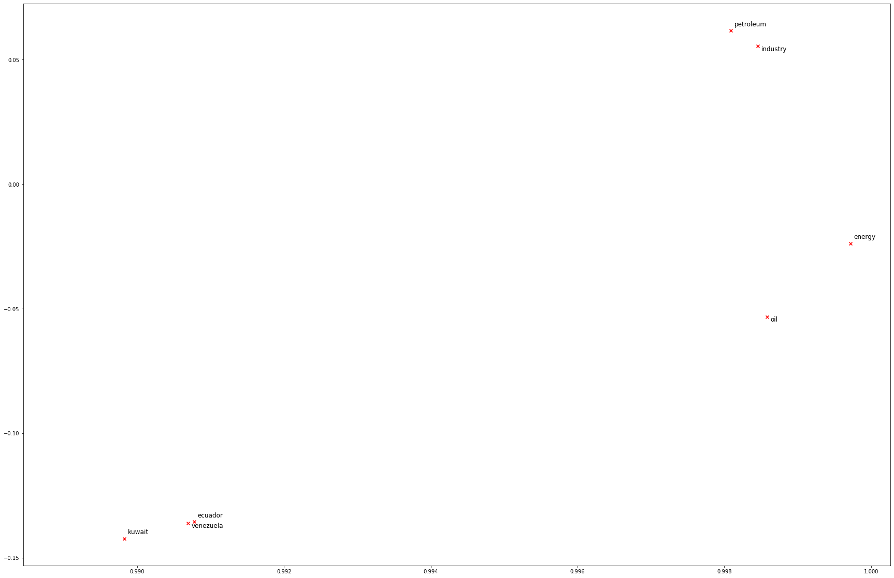
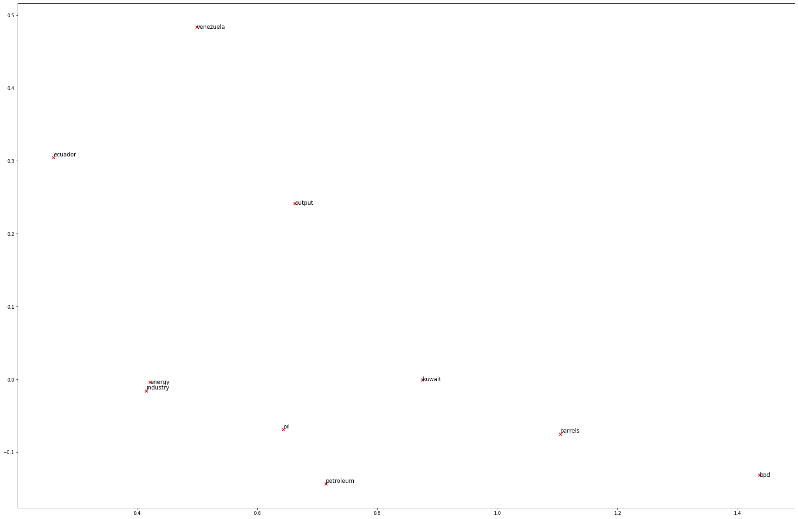
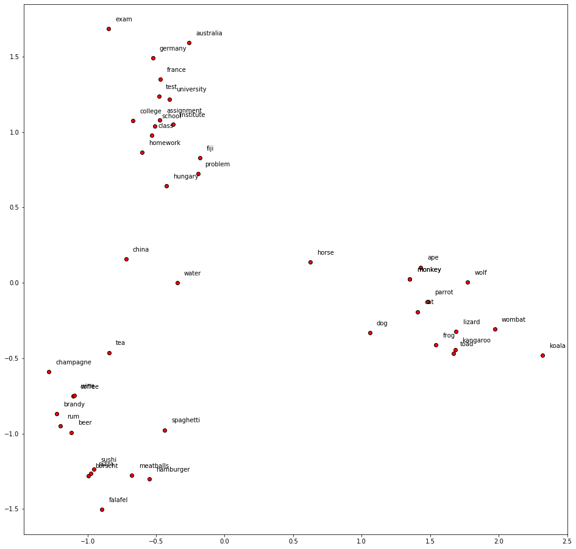

# NLP using Word Vectors: 

    ## Count and prediction based methods investigated to generate Word embedding. 

**Thanks to Dr. Christopher Manning for the great content on NLP.**

We explore two types of word vectors in this notebook; those derived from *occurance matrices* and those from *word2vec*. Word vectors involve embedding the meaning of a word in a lower dimension in the form of a vector, hence the terms *word vectors* and *word embeddings* can be used interchangably. 

In the words of John Rupert Firth the idea in NLP is often, **"You shall know a word by the company it keeps"**. 

## Count based word vectors: 

**Intuition on Word Vectors and Count based methods:** Many words that are (near) synonyms are used in a similar context. That is, similar words are used along with a shared subset of words (or contexts). We will examine these contexts to develop the word embeddings. (Old school) Word vectors are often constructed using word count methods. One such strategy is the *co-occurance matrix*. 

### Co-Occurrence: 
Co-occurance measures how often a words co-occurs with one another. For example, give a word $w_{j}$, we consider the context window for length $n$, that is words: [$w_{j-n}$, $w_{j-(n-1)}$, $ .. $, $w_{j+n-1}$, $w_{j+n}$]. We get a symmetric matrix, which is usually large and requires dimention reduction using PCA or other dimentionality reduction techniques. 


```python
# All Import Statements Defined Here
# Note: Do not add to this list.
# All the dependencies you need, can be installed by running .
# ----------------

import sys
assert sys.version_info[0]==3
assert sys.version_info[1] >= 5

from gensim.models import KeyedVectors
from gensim.test.utils import datapath
import pprint
import matplotlib.pyplot as plt
plt.rcParams['figure.figsize'] = [10, 5]
import nltk
nltk.download('reuters')
from nltk.corpus import reuters
import numpy as np
import random
import scipy as sp
from sklearn.decomposition import TruncatedSVD
from sklearn.decomposition import PCA

START_TOKEN = '<START>'
END_TOKEN = '<END>'

np.random.seed(0)
random.seed(0)
# ----------------
```

    unable to import 'smart_open.gcs', disabling that module
    [nltk_data] Downloading package reuters to
    [nltk_data]     /Users/ashwinpadmanabhan/nltk_data...
    [nltk_data]   Package reuters is already up-to-date!


```python
#reading articles in Reuter's crude (petroleum related) articles

def read_corpus(category="crude"):
    """ Read files from the specified Reuter's category.
        Params:
            category (string): category name
        Return:
            list of lists, with words from each of the processed files
    """
    files = reuters.fileids(category)
    return [[START_TOKEN] + [w.lower() for w in list(reuters.words(f))] + [END_TOKEN] for f in files]
```


```python
# Printing it out. 
reuters_corpus = read_corpus()
pprint.pprint(reuters_corpus[:3], compact=True, width=100)
```

    [['<START>', 'japan', 'to', 'revise', 'long', '-', 'term', 'energy', 'demand', 'downwards', 'the',
      'ministry', 'of', 'international', 'trade', 'and', 'industry', '(', 'miti', ')', 'will', 'revise',
      'its', 'long', '-', 'term', 'energy', 'supply', '/', 'demand', 'outlook', 'by', 'august', 'to',
      'meet', 'a', 'forecast', 'downtrend', 'in', 'japanese', 'energy', 'demand', ',', 'ministry',
      'officials', 'said', '.', 'miti', 'is', 'expected', 'to', 'lower', 'the', 'projection', 'for',
      'primary', 'energy', 'supplies', 'in', 'the', 'year', '2000', 'to', '550', 'mln', 'kilolitres',
      '(', 'kl', ')', 'from', '600', 'mln', ',', 'they', 'said', '.', 'the', 'decision', 'follows',
      'the', 'emergence', 'of', 'structural', 'changes', 'in', 'japanese', 'industry', 'following',
      'the', 'rise', 'in', 'the', 'value', 'of', 'the', 'yen', 'and', 'a', 'decline', 'in', 'domestic',
      'electric', 'power', 'demand', '.', 'miti', 'is', 'planning', 'to', 'work', 'out', 'a', 'revised',
      'energy', 'supply', '/', 'demand', 'outlook', 'through', 'deliberations', 'of', 'committee',
      'meetings', 'of', 'the', 'agency', 'of', 'natural', 'resources', 'and', 'energy', ',', 'the',
      'officials', 'said', '.', 'they', 'said', 'miti', 'will', 'also', 'review', 'the', 'breakdown',
      'of', 'energy', 'supply', 'sources', ',', 'including', 'oil', ',', 'nuclear', ',', 'coal', 'and',
      'natural', 'gas', '.', 'nuclear', 'energy', 'provided', 'the', 'bulk', 'of', 'japan', "'", 's',
      'electric', 'power', 'in', 'the', 'fiscal', 'year', 'ended', 'march', '31', ',', 'supplying',
      'an', 'estimated', '27', 'pct', 'on', 'a', 'kilowatt', '/', 'hour', 'basis', ',', 'followed',
      'by', 'oil', '(', '23', 'pct', ')', 'and', 'liquefied', 'natural', 'gas', '(', '21', 'pct', '),',
      'they', 'noted', '.', '<END>'],
     ['<START>', 'energy', '/', 'u', '.', 's', '.', 'petrochemical', 'industry', 'cheap', 'oil',
      'feedstocks', ',', 'the', 'weakened', 'u', '.', 's', '.', 'dollar', 'and', 'a', 'plant',
      'utilization', 'rate', 'approaching', '90', 'pct', 'will', 'propel', 'the', 'streamlined', 'u',
      '.', 's', '.', 'petrochemical', 'industry', 'to', 'record', 'profits', 'this', 'year', ',',
      'with', 'growth', 'expected', 'through', 'at', 'least', '1990', ',', 'major', 'company',
      'executives', 'predicted', '.', 'this', 'bullish', 'outlook', 'for', 'chemical', 'manufacturing',
      'and', 'an', 'industrywide', 'move', 'to', 'shed', 'unrelated', 'businesses', 'has', 'prompted',
      'gaf', 'corp', '&', 'lt', ';', 'gaf', '>,', 'privately', '-', 'held', 'cain', 'chemical', 'inc',
      ',', 'and', 'other', 'firms', 'to', 'aggressively', 'seek', 'acquisitions', 'of', 'petrochemical',
      'plants', '.', 'oil', 'companies', 'such', 'as', 'ashland', 'oil', 'inc', '&', 'lt', ';', 'ash',
      '>,', 'the', 'kentucky', '-', 'based', 'oil', 'refiner', 'and', 'marketer', ',', 'are', 'also',
      'shopping', 'for', 'money', '-', 'making', 'petrochemical', 'businesses', 'to', 'buy', '.', '"',
      'i', 'see', 'us', 'poised', 'at', 'the', 'threshold', 'of', 'a', 'golden', 'period', ',"', 'said',
      'paul', 'oreffice', ',', 'chairman', 'of', 'giant', 'dow', 'chemical', 'co', '&', 'lt', ';',
      'dow', '>,', 'adding', ',', '"', 'there', "'", 's', 'no', 'major', 'plant', 'capacity', 'being',
      'added', 'around', 'the', 'world', 'now', '.', 'the', 'whole', 'game', 'is', 'bringing', 'out',
      'new', 'products', 'and', 'improving', 'the', 'old', 'ones', '."', 'analysts', 'say', 'the',
      'chemical', 'industry', "'", 's', 'biggest', 'customers', ',', 'automobile', 'manufacturers',
      'and', 'home', 'builders', 'that', 'use', 'a', 'lot', 'of', 'paints', 'and', 'plastics', ',',
      'are', 'expected', 'to', 'buy', 'quantities', 'this', 'year', '.', 'u', '.', 's', '.',
      'petrochemical', 'plants', 'are', 'currently', 'operating', 'at', 'about', '90', 'pct',
      'capacity', ',', 'reflecting', 'tighter', 'supply', 'that', 'could', 'hike', 'product', 'prices',
      'by', '30', 'to', '40', 'pct', 'this', 'year', ',', 'said', 'john', 'dosher', ',', 'managing',
      'director', 'of', 'pace', 'consultants', 'inc', 'of', 'houston', '.', 'demand', 'for', 'some',
      'products', 'such', 'as', 'styrene', 'could', 'push', 'profit', 'margins', 'up', 'by', 'as',
      'much', 'as', '300', 'pct', ',', 'he', 'said', '.', 'oreffice', ',', 'speaking', 'at', 'a',
      'meeting', 'of', 'chemical', 'engineers', 'in', 'houston', ',', 'said', 'dow', 'would', 'easily',
      'top', 'the', '741', 'mln', 'dlrs', 'it', 'earned', 'last', 'year', 'and', 'predicted', 'it',
      'would', 'have', 'the', 'best', 'year', 'in', 'its', 'history', '.', 'in', '1985', ',', 'when',
      'oil', 'prices', 'were', 'still', 'above', '25', 'dlrs', 'a', 'barrel', 'and', 'chemical',
      'exports', 'were', 'adversely', 'affected', 'by', 'the', 'strong', 'u', '.', 's', '.', 'dollar',
      ',', 'dow', 'had', 'profits', 'of', '58', 'mln', 'dlrs', '.', '"', 'i', 'believe', 'the',
      'entire', 'chemical', 'industry', 'is', 'headed', 'for', 'a', 'record', 'year', 'or', 'close',
      'to', 'it', ',"', 'oreffice', 'said', '.', 'gaf', 'chairman', 'samuel', 'heyman', 'estimated',
      'that', 'the', 'u', '.', 's', '.', 'chemical', 'industry', 'would', 'report', 'a', '20', 'pct',
      'gain', 'in', 'profits', 'during', '1987', '.', 'last', 'year', ',', 'the', 'domestic',
      'industry', 'earned', 'a', 'total', 'of', '13', 'billion', 'dlrs', ',', 'a', '54', 'pct', 'leap',
      'from', '1985', '.', 'the', 'turn', 'in', 'the', 'fortunes', 'of', 'the', 'once', '-', 'sickly',
      'chemical', 'industry', 'has', 'been', 'brought', 'about', 'by', 'a', 'combination', 'of', 'luck',
      'and', 'planning', ',', 'said', 'pace', "'", 's', 'john', 'dosher', '.', 'dosher', 'said', 'last',
      'year', "'", 's', 'fall', 'in', 'oil', 'prices', 'made', 'feedstocks', 'dramatically', 'cheaper',
      'and', 'at', 'the', 'same', 'time', 'the', 'american', 'dollar', 'was', 'weakening', 'against',
      'foreign', 'currencies', '.', 'that', 'helped', 'boost', 'u', '.', 's', '.', 'chemical',
      'exports', '.', 'also', 'helping', 'to', 'bring', 'supply', 'and', 'demand', 'into', 'balance',
      'has', 'been', 'the', 'gradual', 'market', 'absorption', 'of', 'the', 'extra', 'chemical',
      'manufacturing', 'capacity', 'created', 'by', 'middle', 'eastern', 'oil', 'producers', 'in',
      'the', 'early', '1980s', '.', 'finally', ',', 'virtually', 'all', 'major', 'u', '.', 's', '.',
      'chemical', 'manufacturers', 'have', 'embarked', 'on', 'an', 'extensive', 'corporate',
      'restructuring', 'program', 'to', 'mothball', 'inefficient', 'plants', ',', 'trim', 'the',
      'payroll', 'and', 'eliminate', 'unrelated', 'businesses', '.', 'the', 'restructuring', 'touched',
      'off', 'a', 'flurry', 'of', 'friendly', 'and', 'hostile', 'takeover', 'attempts', '.', 'gaf', ',',
      'which', 'made', 'an', 'unsuccessful', 'attempt', 'in', '1985', 'to', 'acquire', 'union',
      'carbide', 'corp', '&', 'lt', ';', 'uk', '>,', 'recently', 'offered', 'three', 'billion', 'dlrs',
      'for', 'borg', 'warner', 'corp', '&', 'lt', ';', 'bor', '>,', 'a', 'chicago', 'manufacturer',
      'of', 'plastics', 'and', 'chemicals', '.', 'another', 'industry', 'powerhouse', ',', 'w', '.',
      'r', '.', 'grace', '&', 'lt', ';', 'gra', '>', 'has', 'divested', 'its', 'retailing', ',',
      'restaurant', 'and', 'fertilizer', 'businesses', 'to', 'raise', 'cash', 'for', 'chemical',
      'acquisitions', '.', 'but', 'some', 'experts', 'worry', 'that', 'the', 'chemical', 'industry',
      'may', 'be', 'headed', 'for', 'trouble', 'if', 'companies', 'continue', 'turning', 'their',
      'back', 'on', 'the', 'manufacturing', 'of', 'staple', 'petrochemical', 'commodities', ',', 'such',
      'as', 'ethylene', ',', 'in', 'favor', 'of', 'more', 'profitable', 'specialty', 'chemicals',
      'that', 'are', 'custom', '-', 'designed', 'for', 'a', 'small', 'group', 'of', 'buyers', '.', '"',
      'companies', 'like', 'dupont', '&', 'lt', ';', 'dd', '>', 'and', 'monsanto', 'co', '&', 'lt', ';',
      'mtc', '>', 'spent', 'the', 'past', 'two', 'or', 'three', 'years', 'trying', 'to', 'get', 'out',
      'of', 'the', 'commodity', 'chemical', 'business', 'in', 'reaction', 'to', 'how', 'badly', 'the',
      'market', 'had', 'deteriorated', ',"', 'dosher', 'said', '.', '"', 'but', 'i', 'think', 'they',
      'will', 'eventually', 'kill', 'the', 'margins', 'on', 'the', 'profitable', 'chemicals', 'in',
      'the', 'niche', 'market', '."', 'some', 'top', 'chemical', 'executives', 'share', 'the',
      'concern', '.', '"', 'the', 'challenge', 'for', 'our', 'industry', 'is', 'to', 'keep', 'from',
      'getting', 'carried', 'away', 'and', 'repeating', 'past', 'mistakes', ',"', 'gaf', "'", 's',
      'heyman', 'cautioned', '.', '"', 'the', 'shift', 'from', 'commodity', 'chemicals', 'may', 'be',
      'ill', '-', 'advised', '.', 'specialty', 'businesses', 'do', 'not', 'stay', 'special', 'long',
      '."', 'houston', '-', 'based', 'cain', 'chemical', ',', 'created', 'this', 'month', 'by', 'the',
      'sterling', 'investment', 'banking', 'group', ',', 'believes', 'it', 'can', 'generate', '700',
      'mln', 'dlrs', 'in', 'annual', 'sales', 'by', 'bucking', 'the', 'industry', 'trend', '.',
      'chairman', 'gordon', 'cain', ',', 'who', 'previously', 'led', 'a', 'leveraged', 'buyout', 'of',
      'dupont', "'", 's', 'conoco', 'inc', "'", 's', 'chemical', 'business', ',', 'has', 'spent', '1',
      '.', '1', 'billion', 'dlrs', 'since', 'january', 'to', 'buy', 'seven', 'petrochemical', 'plants',
      'along', 'the', 'texas', 'gulf', 'coast', '.', 'the', 'plants', 'produce', 'only', 'basic',
      'commodity', 'petrochemicals', 'that', 'are', 'the', 'building', 'blocks', 'of', 'specialty',
      'products', '.', '"', 'this', 'kind', 'of', 'commodity', 'chemical', 'business', 'will', 'never',
      'be', 'a', 'glamorous', ',', 'high', '-', 'margin', 'business', ',"', 'cain', 'said', ',',
      'adding', 'that', 'demand', 'is', 'expected', 'to', 'grow', 'by', 'about', 'three', 'pct',
      'annually', '.', 'garo', 'armen', ',', 'an', 'analyst', 'with', 'dean', 'witter', 'reynolds', ',',
      'said', 'chemical', 'makers', 'have', 'also', 'benefitted', 'by', 'increasing', 'demand', 'for',
      'plastics', 'as', 'prices', 'become', 'more', 'competitive', 'with', 'aluminum', ',', 'wood',
      'and', 'steel', 'products', '.', 'armen', 'estimated', 'the', 'upturn', 'in', 'the', 'chemical',
      'business', 'could', 'last', 'as', 'long', 'as', 'four', 'or', 'five', 'years', ',', 'provided',
      'the', 'u', '.', 's', '.', 'economy', 'continues', 'its', 'modest', 'rate', 'of', 'growth', '.',
      '<END>'],
     ['<START>', 'turkey', 'calls', 'for', 'dialogue', 'to', 'solve', 'dispute', 'turkey', 'said',
      'today', 'its', 'disputes', 'with', 'greece', ',', 'including', 'rights', 'on', 'the',
      'continental', 'shelf', 'in', 'the', 'aegean', 'sea', ',', 'should', 'be', 'solved', 'through',
      'negotiations', '.', 'a', 'foreign', 'ministry', 'statement', 'said', 'the', 'latest', 'crisis',
      'between', 'the', 'two', 'nato', 'members', 'stemmed', 'from', 'the', 'continental', 'shelf',
      'dispute', 'and', 'an', 'agreement', 'on', 'this', 'issue', 'would', 'effect', 'the', 'security',
      ',', 'economy', 'and', 'other', 'rights', 'of', 'both', 'countries', '.', '"', 'as', 'the',
      'issue', 'is', 'basicly', 'political', ',', 'a', 'solution', 'can', 'only', 'be', 'found', 'by',
      'bilateral', 'negotiations', ',"', 'the', 'statement', 'said', '.', 'greece', 'has', 'repeatedly',
      'said', 'the', 'issue', 'was', 'legal', 'and', 'could', 'be', 'solved', 'at', 'the',
      'international', 'court', 'of', 'justice', '.', 'the', 'two', 'countries', 'approached', 'armed',
      'confrontation', 'last', 'month', 'after', 'greece', 'announced', 'it', 'planned', 'oil',
      'exploration', 'work', 'in', 'the', 'aegean', 'and', 'turkey', 'said', 'it', 'would', 'also',
      'search', 'for', 'oil', '.', 'a', 'face', '-', 'off', 'was', 'averted', 'when', 'turkey',
      'confined', 'its', 'research', 'to', 'territorrial', 'waters', '.', '"', 'the', 'latest',
      'crises', 'created', 'an', 'historic', 'opportunity', 'to', 'solve', 'the', 'disputes', 'between',
      'the', 'two', 'countries', ',"', 'the', 'foreign', 'ministry', 'statement', 'said', '.', 'turkey',
      "'", 's', 'ambassador', 'in', 'athens', ',', 'nazmi', 'akiman', ',', 'was', 'due', 'to', 'meet',
      'prime', 'minister', 'andreas', 'papandreou', 'today', 'for', 'the', 'greek', 'reply', 'to', 'a',
      'message', 'sent', 'last', 'week', 'by', 'turkish', 'prime', 'minister', 'turgut', 'ozal', '.',
      'the', 'contents', 'of', 'the', 'message', 'were', 'not', 'disclosed', '.', '<END>']]


Determing the number of distinct words and number of distinct words in the corpus. 


```python
def distinct_words(corpus= reuters_corpus):
    """ Determine a list of distinct words for the corpus.
        Params:
            corpus (list of list of strings): corpus of documents
        Return:
            corpus_words (list of strings): list of distinct words across the corpus, sorted.
            num_corpus_words (integer): number of distinct words across the corpus
    """
    corpus_words = []
    num_corpus_words = -1
    
    corpus_words += [x for y in corpus for x in y  ]
    corpus_words = sorted(list(set(corpus_words)))
    num_corpus_words = len(corpus_words)

    return corpus_words, num_corpus_words
```

Running a sanity check:


```python
# ---------------------
# Run this sanity check
# Note that this not an exhaustive check for correctness.
# ---------------------

# Define toy corpus
test_corpus = ["START All that glitters isn't gold END".split(" "), "START All's well that ends well END".split(" ")]
test_corpus_words, num_corpus_words = distinct_words(corpus = test_corpus)

# Correct answers
ans_test_corpus_words = sorted(list(set(["START", "All", "ends", "that", "gold", "All's", "glitters", "isn't", "well", "END"])))
ans_num_corpus_words = len(ans_test_corpus_words)

# Test correct number of words
assert(num_corpus_words == ans_num_corpus_words), "Incorrect number of distinct words. Correct: {}. Yours: {}".format(ans_num_corpus_words, num_corpus_words)

# Test correct words
assert (test_corpus_words == ans_test_corpus_words), "Incorrect corpus_words.\nCorrect: {}\nYours:   {}".format(str(ans_test_corpus_words), str(test_corpus_words))

# Print Success
print ("-" * 80)
print("Passed All Tests!")
print ("-" * 80)
```

    --------------------------------------------------------------------------------
    Passed All Tests!
    --------------------------------------------------------------------------------


```python
def compute_co_occurrence_matrix(corpus, window_size=4):
    """ Compute co-occurrence matrix for the given corpus and window_size (default of 4).
    
        Note: Each word in a document should be at the center of a window. Words near edges will have a smaller
              number of co-occurring words.
              
              For example, if we take the document "START All that glitters is not gold END" with window size of 4,
              "All" will co-occur with "START", "that", "glitters", "is", and "not".
    
        Params:
            corpus (list of list of strings): corpus of documents
            window_size (int): size of context window
        Return:
            M (numpy matrix of shape (number of corpus words, number of corpus words)): 
                Co-occurence matrix of word counts. 
                The ordering of the words in the rows/columns should be the same as the ordering of the words given by the distinct_words function.
            word2Ind (dict): dictionary that maps word to index (i.e. row/column number) for matrix M.
    """
    raw_words = [x for y in corpus for x in y]
    
    words, num_words = distinct_words(corpus)
    M = np.zeros((num_words, num_words) )
    
    word2Ind = {}
    
    word2Ind = {words[i] : i for i in range(len(words))}
    
    for i in range(len(raw_words)):
        for j in range(max( (i-window_size), 0), min((i + window_size+1), len(raw_words))):
            if i != j  :
                #Dont want to add sentence "START END or END START"
                #if not ( ( word2Ind[raw_words[i]] ==word2Ind["START"] and  word2Ind[raw_words[j]]==word2Ind["END"]) or ( word2Ind[raw_words[i]] ==word2Ind["END"] and  word2Ind[raw_words[j]]==word2Ind["START"])) :
                    M[ word2Ind[raw_words[i]], word2Ind[raw_words[j]] ] += 1

    return M, word2Ind

```


```python
# Run this sanity check
# Note that this is not an exhaustive check for correctness.
# ---------------------

# Define toy corpus and get student's co-occurrence matrix
test_corpus = ["START All that glitters isn't gold END".split(" "), "START All's well that ends well END".split(" ")]
[corpus, size_corpus] = distinct_words(corpus= test_corpus)
M_test, word2Ind_test = compute_co_occurrence_matrix(test_corpus, window_size=1)

# Correct M and word2Ind
M_test_ans = np.array( 
    [[0., 0., 0., 1., 0., 0., 0., 0., 1., 0.,],
     [0., 0., 0., 1., 0., 0., 0., 0., 0., 1.,],
     [0., 0., 0., 0., 0., 0., 1., 0., 0., 1.,],
     [1., 1., 0., 0., 0., 0., 0., 0., 0., 0.,],
     [0., 0., 0., 0., 0., 0., 0., 0., 1., 1.,],
     [0., 0., 0., 0., 0., 0., 0., 1., 1., 0.,],
     [0., 0., 1., 0., 0., 0., 0., 1., 0., 0.,],
     [0., 0., 0., 0., 0., 1., 1., 0., 0., 0.,],
     [1., 0., 0., 0., 1., 1., 0., 0., 0., 1.,],
     [0., 1., 1., 0., 1., 0., 0., 0., 1., 0.,]]
)
word2Ind_ans = {'All': 0, "All's": 1, 'END': 2, 'START': 3, 'ends': 4, 'glitters': 5, 'gold': 6, "isn't": 7, 'that': 8, 'well': 9}

# Test correct word2Ind
assert (word2Ind_ans == word2Ind_test), "Your word2Ind is incorrect:\nCorrect: {}\nYours: {}".format(word2Ind_ans, word2Ind_test)

# Test correct M shape
assert (M_test.shape == M_test_ans.shape), "M matrix has incorrect shape.\nCorrect: {}\nYours: {}".format(M_test.shape, M_test_ans.shape)

# Test correct M values
for w1 in word2Ind_ans.keys():
    idx1 = word2Ind_ans[w1]
    for w2 in word2Ind_ans.keys():
        idx2 = word2Ind_ans[w2]
        student = M_test[idx1, idx2]
        correct = M_test_ans[idx1, idx2]
        if student != correct:
            print("Correct M:")
            print(M_test_ans)
            print("Your M: ")
            print(M_test)
            raise AssertionError("Incorrect count at index ({}, {})=({}, {}) in matrix M. Yours has {} but should have {}.".format(idx1, idx2, w1, w2, student, correct))

# Print Success
print ("-" * 80)
print("Passed All Tests!")
print ("-" * 80)
```

    Correct M:
    [[0. 0. 0. 1. 0. 0. 0. 0. 1. 0.]
     [0. 0. 0. 1. 0. 0. 0. 0. 0. 1.]
     [0. 0. 0. 0. 0. 0. 1. 0. 0. 1.]
     [1. 1. 0. 0. 0. 0. 0. 0. 0. 0.]
     [0. 0. 0. 0. 0. 0. 0. 0. 1. 1.]
     [0. 0. 0. 0. 0. 0. 0. 1. 1. 0.]
     [0. 0. 1. 0. 0. 0. 0. 1. 0. 0.]
     [0. 0. 0. 0. 0. 1. 1. 0. 0. 0.]
     [1. 0. 0. 0. 1. 1. 0. 0. 0. 1.]
     [0. 1. 1. 0. 1. 0. 0. 0. 1. 0.]]
    Your M: 
    [[0. 0. 0. 1. 0. 0. 0. 0. 1. 0.]
     [0. 0. 0. 1. 0. 0. 0. 0. 0. 1.]
     [0. 0. 0. 1. 0. 0. 1. 0. 0. 1.]
     [1. 1. 1. 0. 0. 0. 0. 0. 0. 0.]
     [0. 0. 0. 0. 0. 0. 0. 0. 1. 1.]
     [0. 0. 0. 0. 0. 0. 0. 1. 1. 0.]
     [0. 0. 1. 0. 0. 0. 0. 1. 0. 0.]
     [0. 0. 0. 0. 0. 1. 1. 0. 0. 0.]
     [1. 0. 0. 0. 1. 1. 0. 0. 0. 1.]
     [0. 1. 1. 0. 1. 0. 0. 0. 1. 0.]]


    ---------------------------------------------------------------------------

    AssertionError                            Traceback (most recent call last)

    <ipython-input-7-01cc34698b7e> in <module>
         41             print("Your M: ")
         42             print(M_test)
    ---> 43             raise AssertionError("Incorrect count at index ({}, {})=({}, {}) in matrix M. Yours has {} but should have {}.".format(idx1, idx2, w1, w2, student, correct))
         44 
         45 # Print Success


    AssertionError: Incorrect count at index (2, 3)=(END, START) in matrix M. Yours has 1.0 but should have 0.0.


## PCA to reduce co-occurancy matrix to k dims: 


```python
from sklearn.decomposition import TruncatedSVD
def reduce_to_k_dim(M, k=2):
    """ Reduce a co-occurence count matrix of dimensionality (num_corpus_words, num_corpus_words)
        to a matrix of dimensionality (num_corpus_words, k) using the following SVD function from Scikit-Learn:
            - http://scikit-learn.org/stable/modules/generated/sklearn.decomposition.TruncatedSVD.html
    
        Params:
            M (numpy matrix of shape (number of corpus words, number of corpus words)): co-occurence matrix of word counts
            k (int): embedding size of each word after dimension reduction
        Return:
            M_reduced (numpy matrix of shape (number of corpus words, k)): matrix of k-dimensioal word embeddings.
                    In terms of the SVD from math class, this actually returns U * S
    """    
    n_iters = 10     # Use this parameter in your call to `TruncatedSVD`
    M_reduced = None
    print("Running Truncated SVD over %i words..." % (M.shape[0]))
    svd = TruncatedSVD(n_components=k, n_iter=7, random_state=42)
    svd.fit(M)
    M_reduced = svd.transform(M)
    print("Done.")
    return M_reduced
```


```python
# ---------------------
# Run this sanity check
# Note that this not an exhaustive check for correctness 
# In fact we only check that your M_reduced has the right dimensions.
# ---------------------

# Define toy corpus and run student code
test_corpus = ["START All that glitters isn't gold END".split(" "), "START All's well that ends well END".split(" ")]
M_test, word2Ind_test = compute_co_occurrence_matrix(test_corpus, window_size=1)
M_test_reduced = reduce_to_k_dim(M_test, k=2)

# Test proper dimensions
assert (M_test_reduced.shape[0] == 10), "M_reduced has {} rows; should have {}".format(M_test_reduced.shape[0], 10)
assert (M_test_reduced.shape[1] == 2), "M_reduced has {} columns; should have {}".format(M_test_reduced.shape[1], 2)

# Print Success
print ("-" * 80)
print("Passed All Tests!")
print ("-" * 80)
```

    Running Truncated SVD over 10 words...
    Done.
    --------------------------------------------------------------------------------
    Passed All Tests!
    --------------------------------------------------------------------------------


```python
%matplotlib inline
import matplotlib.pyplot as plt

def plot_embeddings(M_reduced, word2Ind, words):
    """ Plot in a scatterplot the embeddings of the words specified in the list "words".
        NOTE: do not plot all the words listed in M_reduced / word2Ind.
        Include a label next to each point.
        
        Params:
            M_reduced (numpy matrix of shape (number of unique words in the corpus , k)): matrix of k-dimensioal word embeddings
            word2Ind (dict): dictionary that maps word to indices for matrix M
            words (list of strings): words whose embeddings we want to visualize
    """    
    # simulating a pandas df['type'] column
    plt.figure(figsize = (15,10))
    types = words
    x_coords = [M_reduced[word2Ind[words[i] ], 0] for i in range(len(words))]
    y_coords = [M_reduced[word2Ind[words[i] ], 1] for i in range(len(words))]

    for i,type in enumerate(types):
        x = x_coords[i]
        y = y_coords[i]
        plt.scatter(x, y, marker='x', color='red')
        if i%2 ==0:
            mul = 1
        else: 
            mul = -1
        plt.text(x+0.000047, y + mul*0.00187, type, fontsize=12)
    plt.show()
```


```python
# -----------------------------
# Run This Cell to Produce Your Plot
# ------------------------------
%matplotlib inline
import matplotlib.pyplot as plt

reuters_corpus = read_corpus()
[M_co_occurrence, word2Ind_co_occurrence] = compute_co_occurrence_matrix(reuters_corpus)
M_reduced_co_occurrence = reduce_to_k_dim(M_co_occurrence, k=2)

# Rescale (normalize) the rows to make them each of unit-length
M_lengths = np.linalg.norm(M_reduced_co_occurrence, axis=1)
M_normalized = M_reduced_co_occurrence / M_lengths[:, np.newaxis] # broadcasting

#words = ['barrels', 'bpd', 'ecuador', 'energy', 'industry', 'kuwait', 'oil', 'output', 'petroleum', 'venezuela']
words = ['ecuador', 'venezuela', 'energy', 'industry', 'kuwait', 'oil', 'petroleum' ]
plot_embeddings(M_normalized, word2Ind_co_occurrence, words)
```

    Running Truncated SVD over 8185 words...
    Done.





## Part 2: Prediction-Based Word Vectors

This part explores the use of word2vec algorithm to create word embeddings. 

Let us first create a function to read the information.The function takes several minutes to run. 


```python
def load_word2vec():
    """ Load Word2Vec Vectors
        Return:
            wv_from_bin: All 3 million embeddings, each lengh 300
    """
    import gensim.downloader as api
    wv_from_bin = api.load("word2vec-google-news-300")
    vocab = list(wv_from_bin.vocab.keys())
    print("Loaded vocab size %i" % len(vocab))
    return wv_from_bin
```


```python
"""
Loading word-vectors: Takes a few minutes, uncomment for selective run. 
"""

wv_from_bin = load_word2vec()
```

    Loaded vocab size 3000000


#### Reducing dimensionality of Word2Vec Word Embeddings


```python
def get_matrix_of_vectors(wv_from_bin, required_words=['barrels', 'bpd', 'ecuador', 'energy', 'industry', 'kuwait', 'oil', 'output', 'petroleum', 'venezuela']):
    """ Put the word2vec vectors into a matrix M.
        Param:
            wv_from_bin: KeyedVectors object; the 3 million word2vec vectors loaded from file
        Return:
            M: numpy matrix shape (num words, 300) containing the vectors
            word2Ind: dictionary mapping each word to its row number in M
    """
    import random
    words = list(wv_from_bin.vocab.keys())
    print("Shuffling words ...")
    random.shuffle(words)
    words = words[:10000]
    print("Putting %i words into word2Ind and matrix M..." % len(words))
    word2Ind = {}
    M = []
    curInd = 0
    for w in words:
        try:
            M.append(wv_from_bin.word_vec(w))
            word2Ind[w] = curInd
            curInd += 1
        except KeyError:
            continue
    for w in required_words:
        try:
            M.append(wv_from_bin.word_vec(w))
            word2Ind[w] = curInd
            curInd += 1
        except KeyError:
            continue
    M = np.stack(M)
    print("Done.")
    return M, word2Ind
```


```python
# -----------------------------------------------------------------
# Run Cell to Reduce 300-Dimensinal Word Embeddings to k Dimensions
# Note: This may take several minutes
# -----------------------------------------------------------------
M, word2Ind = get_matrix_of_vectors(wv_from_bin)
M_reduced = reduce_to_k_dim(M, k=2)
```

    Shuffling words ...
    Putting 10000 words into word2Ind and matrix M...
    Done.
    Running Truncated SVD over 10010 words...
    Done.


### Plotting the embeddings using word2vec.. 


```python
words = ['barrels', 'bpd', 'ecuador', 'energy', 'industry', 'kuwait', 'oil', 'output', 'petroleum', 'venezuela']
plot_embeddings(M_reduced, word2Ind, words)
```





### Plotting function: 


```python
def display_pca_scatterplot(model, words=None, sample=0):
    if words == None:
        if sample > 0:
            words = np.random.choice(list(model.vocab.keys()), sample)
        else:
            words = [ word for word in model.vocab ]
        
    word_vectors = np.array([model[w] for w in words])

    twodim = PCA().fit_transform(word_vectors)[:,:2]
    
    plt.figure(figsize=(16,16))
    plt.scatter(twodim[:,0], twodim[:,1], edgecolors='k', c='r')
    for word, (x,y) in zip(words, twodim):
        plt.text(x+0.05, y+0.05, word)
```


```python
display_pca_scatterplot(wv_from_bin, 
                        ['coffee', 'tea', 'beer', 'wine', 'brandy', 'rum', 'champagne', 'water',
                         'spaghetti', 'borscht', 'hamburger', 'pizza', 'falafel', 'sushi', 'meatballs',
                         'dog', 'horse', 'cat', 'monkey', 'parrot', 'koala', 'lizard',
                         'frog', 'toad', 'monkey', 'ape', 'kangaroo', 'wombat', 'wolf',
                         'france', 'germany', 'hungary', 'australia', 'fiji', 'china',
                         'homework', 'assignment', 'problem', 'exam', 'test', 'class',
                         'school', 'college', 'university', 'institute'])
```





### Polysemous Words:

Polysemous words are words have two different meanings. Such as "leaves" which can mean something similar to "go away" or the plural of "leaf". Looking for polysemous words in word2vec which capture both meaning.. 


```python
#to test:

wv_from_bin.most_similar(positive = ["obama"])
```


    [('mccain', 0.7319011688232422),
     ('hillary', 0.7284600138664246),
     ('obamas', 0.7229631543159485),
     ('george_bush', 0.720567524433136),
     ('barack_obama', 0.7045838832855225),
     ('palin', 0.7043113708496094),
     ('clinton', 0.6934448480606079),
     ('clintons', 0.6816835403442383),
     ('sarah_palin', 0.6815145015716553),
     ('john_mccain', 0.6800708174705505)]


```python
wv_from_bin.most_similar(positive = ["once"])
```


    [('again', 0.6522716879844666),
     ('Once', 0.6069896221160889),
     ('then', 0.6024324893951416),
     ('never', 0.6013646721839905),
     ('when', 0.596433162689209),
     ('finally', 0.5260249972343445),
     ('twice', 0.5185743570327759),
     ('eventually', 0.5088154077529907),
     ('if', 0.5039767622947693),
     ('suddenly', 0.4684067964553833)]


Guess: Often word2vec does not capture polysemous words because word2vec is trained by maximizing the likelyhood of words occuring together. It is possible that for a polysemous words, one version is used much less frequently than the other. 

### Analogies using word2vec: 

The dimentions in the word vector have meaning and sometimes can be used to make analogies. That is vector addition and subtraction makes sense. 


```python
# Run this cell to answer the analogy -- man : king :: woman : x
def analogy(x1, x2, y1):
    pprint.pprint(wv_from_bin.most_similar(positive=[x2, y1], negative=[x1], topn = 1))
    
analogy("man", "king", "woman")
analogy("japan", "japanese", "india")
analogy("tall", "tallest", "long")
```

    [('queen', 0.7118192911148071)]
    [('indian', 0.5673424005508423)]
    [('longest', 0.5581464767456055)]


### Finding the odd one out: 


```python
print(wv_from_bin.doesnt_match("football cricket tennis pancakes".split()))
```

    pancakes


### Guided Analysis of Bias in Word Vectors

Often the word corpus used have inherent biases. 


```python
# Run this cell
# Here `positive` indicates the list of words to be similar to and `negative` indicates the list of words to be
# most dissimilar from.
pprint.pprint(wv_from_bin.most_similar(positive=['woman', 'boss'], negative=['man']))
print()
pprint.pprint(wv_from_bin.most_similar(positive=['man', 'boss'], negative=['woman']))
```

    [('bosses', 0.5522644519805908),
     ('manageress', 0.49151360988616943),
     ('exec', 0.45940813422203064),
     ('Manageress', 0.45598435401916504),
     ('receptionist', 0.4474116563796997),
     ('Jane_Danson', 0.44480544328689575),
     ('Fiz_Jennie_McAlpine', 0.44275766611099243),
     ('Coronation_Street_actress', 0.44275566935539246),
     ('supremo', 0.4409853219985962),
     ('coworker', 0.43986251950263977)]
    
    [('supremo', 0.6097398400306702),
     ('MOTHERWELL_boss', 0.5489562153816223),
     ('CARETAKER_boss', 0.5375303626060486),
     ('Bully_Wee_boss', 0.5333974361419678),
     ('YEOVIL_Town_boss', 0.5321705341339111),
     ('head_honcho', 0.5281980037689209),
     ('manager_Stan_Ternent', 0.525971531867981),
     ('Viv_Busby', 0.5256162881851196),
     ('striker_Gabby_Agbonlahor', 0.5250812768936157),
     ('BARNSLEY_boss', 0.5238943099975586)]


In the above cell you see that "supremo" is the most likely word which is most similar to "man","boss" and most dissimilar to "woman". At the same time, "supremo" is ranked 9th when we look for words most similar to "woman" and "boss" and most dissimilar to "man". 

These sources of bias occur from the training set itself, perhaps from the authors who created the articles. 
